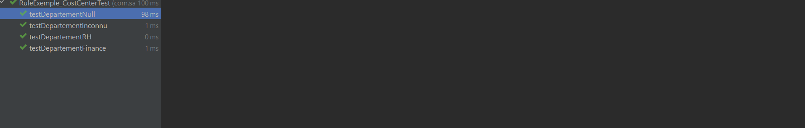

# sailpoint-iam-portfolio
Portfolio de formation Analyste Développeur SailPoint - Gestion des identités (IAM)

# 🛡️ Portfolio SailPoint IAM - Analyste Développeur

## 👤 À propos
Ce repository présente mes compétences en développement et analyse de solutions **SailPoint IdentityIQ**. Il a été réalisé dans le cadre d'une formation spécialisée en **Gestion des Identités et des Accès (IAM)**.

## 🎯 Objectif
Démontrer ma capacité à :
- ✅ Concevoir des solutions techniques conformes aux normes gouvernementales
- ✅ Développer en Java avec des bonnes pratiques (transactions, logs, tests)
- ✅ Documenter rigoureusement le code (spécifications, devis d'essais)
- ✅ Assurer la traçabilité et la sécurité des données

## 📁 Structure du Projet
📁 sailpoint-iam-portfolio/
├── 📄 README.md # Ce fichier
├── 📁 docs/ # Documentation technique
│ ├── Glossaire_IAM.md # Terminologie IAM (FR/EN)
│ ├── Diagramme_Conceptuel.md # Modèle de données UML
│ ├── Spec_Technique_Contexte_Java.md # Spécifications Java
│ └── Devis_Essais.md # Plan de tests unitaires et fonctionnels
└── 📁 src/ # Code source Java
└── 📁 main/java/com/sailpoint/rules/
└── RuleExemple_CostCenter.java # Règle métier documentée

## ⚠️ Note Technique sur l'Environnement

Ce projet utilise des **classes simulées (Mock)** pour les objets SailPoint (`Identity`, `SailPointContext`).

**Pourquoi ?**
Les bibliothèques SailPoint sont propriétaires et nécessitent une licence entreprise pour être accessibles.

**Approche adoptée :**
- Recréation des signatures de méthodes principales pour permettre la compilation.
- Logique métier (Java) 100% fonctionnelle et testée.
- Démonstration de la capacité à intégrer l'API SailPoint une fois l'accès obtenu.

Cette approche permet de valider les compétences Java et la logique IAM sans environnement licencié.

